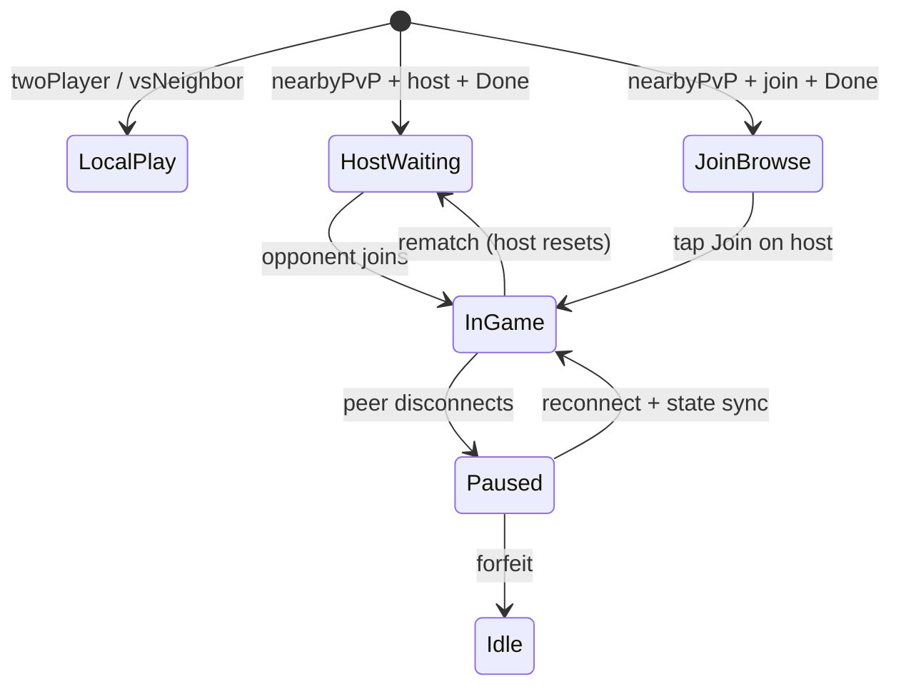
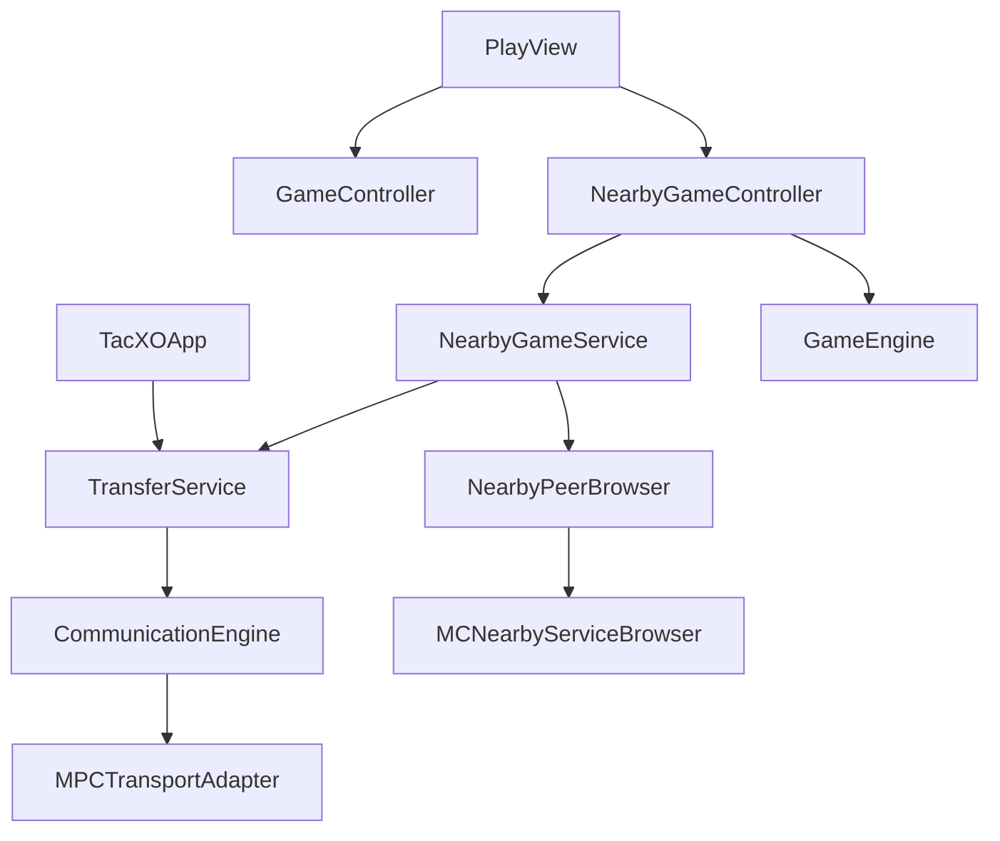

# Nearby PvP — Design Spec

**Date:** 2026-07-01  
**Status:** Approved  
**Package:** [communication-kit](https://github.com/milky-way-66/communication-kit) (`nearby` mode — MPC only)

## Summary

Add **nearby player-vs-player** to TacXO using Multipeer Connectivity via `ComunicationCore` + `ComunicationMPC`. Players configure mode and role in **Settings**; the main screen adapts to host-waiting, join-browse, or in-game board. No backend, no iCloud, no Uncle Sáu in PvP.

## Goals

- Two physical iPhones in the same room can play tic-tac-toe
- Zero changes to main-screen navigation — no extra “Play Nearby” button
- Host sets board size and win length; joiner accepts host rules
- Pause on disconnect until reconnect or forfeit
- Keep solo modes (`twoPlayer`, `vsNeighbor`) unchanged

## Non-goals (v1)

- Remote play (CloudKit / hybrid)
- Cross-platform (Android, web)
- Uncle Sáu comments, quotes, or adaptive difficulty in PvP
- Reconnect without host state sync (host is authoritative)

## Integration mode

| Setting | Value |
|---------|-------|
| SPM products | `ComunicationCore`, `ComunicationMPC` |
| `SERVICE_TYPE` | `tacxo-pvp` |
| Bonjour | `_tacxo-pvp._tcp` |
| Min iOS | 17 (unchanged) |
| Testing | Two physical devices (not Simulator) |

## Settings UX

### Mode picker (3 options)

Segmented control in Settings → Mode:

| Option | Key | Behavior |
|--------|-----|----------|
| Pass & Play | `twoPlayer` | Unchanged — local pass-and-play |
| vs Uncle Sáu | `vsNeighbor` | Unchanged — AI opponent |
| PvP Nearby | `nearbyPvP` | Networked nearby play |

### Role picker (PvP only)

When `mode == .nearbyPvP`, show second segmented control:

| Role | Behavior |
|------|----------|
| **Host** | Board size + win length editable; rules apply to the hosted match |
| **Join** | Board size + win length hidden/disabled; joiner adopts host rules |

### Done handoff

| Role | On Done |
|------|---------|
| Host | Dismiss settings → main screen shows **waiting room** → start MPC advertise + channel |
| Join | Dismiss settings → main screen shows **available games list** → start MPC browse |

Switching mode away from `nearbyPvP` in Settings calls `stopSession()` and tears down MPC.

## Main screen states

`PlayView` remains the single root screen. Content is driven by `settings.mode`, `settings.nearbyRole`, and `nearbySession.phase`.



### Host waiting

- Status: “Waiting for opponent…”
- Shows host rules (e.g. `5×5 · win 5`)
- Optional subtle scanning animation
- **Cancel** stops advertising and returns to idle
- New-game button hidden while waiting

### Join browsing

- List of nearby hosts: device name + rules preview + **Join** button
- Empty state: “No games nearby — ask a friend to host”
- Auto-refresh while browsing

### In-game

- Reuse existing `BoardView` / paper aesthetic
- Host = **X**, joiner = **O**
- Top bar: turn indicator; refresh = rematch (when applicable)
- No neighbor speech bubble, hardness badge, or quote overlay
- Win celebration allowed (generic, no Uncle Sáu copy)

### Paused (disconnect)

- Overlay: “Waiting for [opponent]…”
- Board input disabled
- **Forfeit** on both sides — connected player wins
- On reconnect: host sends full `NearbyGameState`; joiner applies snapshot

## Architecture



### New files

| File | Responsibility |
|------|----------------|
| `TacXO/Networking/AppIdentity.swift` | Stable `ParticipantID` (Keychain UUID) |
| `TacXO/Networking/TransferService.swift` | Engine lifecycle, MPC transport |
| `TacXO/Networking/NearbyPeerBrowser.swift` | List nearby advertisers + parse `discoveryInfo` |
| `TacXO/Networking/NearbyGameMessage.swift` | Codable wire protocol |
| `TacXO/Networking/NearbyGameService.swift` | Host/join/session, send/receive |
| `TacXO/ViewModels/NearbyGameController.swift` | Lobby + in-game orchestration |
| `TacXO/Views/NearbyWaitingView.swift` | Host waiting UI |
| `TacXO/Views/NearbyBrowseView.swift` | Join browse list UI |
| `TacXO/Views/NearbyPauseOverlay.swift` | Disconnect pause + forfeit |

### Modified files

| File | Change |
|------|--------|
| `TacXO/Models/GameSettings.swift` | `GameMode.nearbyPvP`, `NearbyRole`, persistence |
| `TacXO/Engine/GameEngine.swift` | `GameResult: Codable` (for sync) |
| `TacXO/Views/SettingsView.swift` | Third mode + role picker; hide rules for joiner |
| `TacXO/Views/PlayView.swift` | Switch content by nearby phase |
| `TacXO/TacXOApp.swift` | Wire `TransferService` + `NearbyGameController` |
| `project.yml` | SPM deps, Info.plist keys |

## Wire protocol

Host-authoritative: host runs `GameEngine`, validates moves, broadcasts state.

```swift
enum NearbyGameMessage: Codable, Equatable {
    case invite(GameInvite)
    case moveRequest(Cell)
    case gameState(NearbyGameState)
    case forfeit
    case rematchRequest
    case rematchAccepted(GameInvite)
}

struct GameInvite: Codable, Equatable {
    let settings: GameSettings
    let hostParticipantID: String
}

struct NearbyGameState: Codable, Equatable {
    let cells: [Cell: Mark]
    let currentPlayer: Mark
    let result: GameResult
    let winningCells: Set<Cell>
}
```

Sent via `engine.send(message, in: channelID)`. Received via `engine.itemUpdates(for:)`.

### MPC discovery metadata

Host advertiser `discoveryInfo` (read by `NearbyPeerBrowser`):

| Key | Value |
|-----|-------|
| `participantID` | Host's stable ID (matches `AppIdentity`) |
| `boardSize` | e.g. `five` |
| `winLength` | e.g. `5` |

## Data model

```swift
enum GameMode: String, Codable, CaseIterable, Identifiable {
    case twoPlayer
    case vsNeighbor
    case nearbyPvP
}

enum NearbyRole: String, Codable, CaseIterable, Identifiable {
    case host
    case join
}

enum NearbySessionPhase: Equatable {
    case idle
    case advertising   // host waiting
    case browsing      // join scanning
    case connecting    // join in progress
    case playing
    case paused
}
```

## Privacy

Update `PRIVACY.md`: local network used only for nearby game discovery and move sync between devices; no data sent to developer servers.

## Testing

| Test | Method |
|------|--------|
| Message encode/decode | Unit tests (`TacXOTests`) |
| Host move validation | Unit tests on `NearbyGameController` |
| MPC discovery + full game | Manual — two physical iPhones |
| Disconnect / reconnect / forfeit | Manual — two physical iPhones |
| Settings mode switch tears down session | Manual |

## Acceptance criteria

1. Settings shows three modes; PvP mode shows Host/Join role picker.
2. Join role hides board size and win length in Settings.
3. Host: Done → main screen waiting UI; opponent join → game starts with host as X.
4. Join: Done → main screen lists nearby hosts with rules; Join → game starts as O.
5. Moves sync in real time; invalid moves rejected on host.
6. Disconnect pauses game; reconnect restores state; forfeit awards win to remaining player.
7. Switching away from PvP mode stops MPC session.
8. `twoPlayer` and `vsNeighbor` behave exactly as before.
